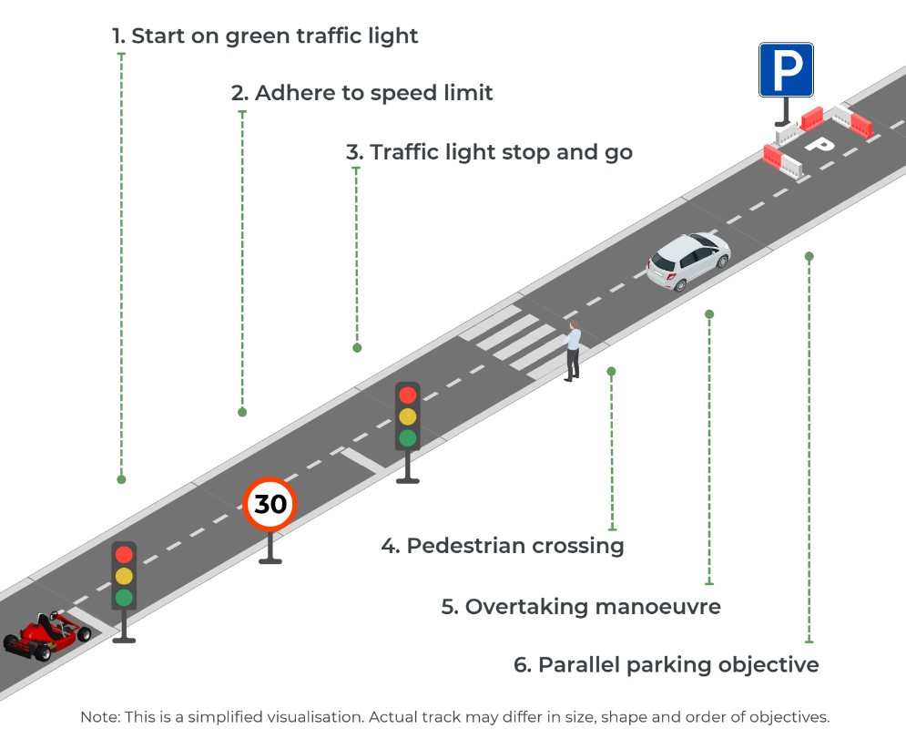

# SDC_2024
  ## Important dates
  - The Self Driving Challenge 2024 officially begins with a launch event on :  
  - February 12th at the RDW Lelystad test track. RDW Test Centre in Lelystad (TCL).
  - June 14th 2024, the final challenge at TCL
  - Weekly access to track possible

  ## Self Driving Challenge Fontys Eindhoven, my code and thoughts online

  - "Gepard Kinderquad 1000w 48v Viper 7 Blue" (https://www.motorpromo.nl/kinderquads/elektrische-midi-quads/g/10454-blue-gepard-viper-7)
    
## Lokatie van bouw
    - Helmond / Eindhoven / Best / ??

## Professional support 
    - Teade Punter, Frans Fonville (Eindhoven) https://www.fontys.nl/Onderzoek/High-tech-embedded-software.htm
    - Peter Dingemans (Tilburg)
    - Bas Geleijns (Helmond Automotive ACE)
    
## Team members
    - E. vd Oetelaar, project lead
    - Sieuwe Elferink, software lead
    - Nik Robben, intern
    - Kristian, graduation
    - ??

## Funding

  * Fontys ICT (Lectoraat/Pulsed/Automotive?)

## Sponsoring

  * Contact (I. Maas, https://www.tandemdrive.com/ )

## book-keeping

  * assign a person

## Time management

  * assign a person

## Engineering documentation

  * assign a person

## Story telling about the challenge

  * assign a person

## Project Overview for Self-Driving Challenge

### Power Management
- **Power from Batteries:** Main power source for vehicle operation.
- **Power from Wall Socket during Development:** Power supply during development phase.
- **Battery Charging:** Considerations for charging, choice between single or dual chargers for motor/control system separation.
- **Battery Backup for Control Systems:** Emergency power supply for control systems.
- **Battery Level Sensing:** Monitoring battery charge and telemetry to the control station.
- **Power for Sub-Systems:** Power supply for various subsystems.

### Control and Safety
- **Remote Control, TeleOp, and RC during Development:** Remote control and operation during development.
- **Control of Motors (Speed, Torque, Wheel Odometry):** Managing motor control including speed, torque, and wheel odometry.
- **Control of Braking:** Managing braking force.
- **Control of Signals:** Managing signals such as turn indicators and state signals (external display of status).
- **Safety Measures:** Safety measures like emergency stop on error and hard braking on power loss.
- **CAN Bus Systems:** Considerations for implementing and necessity of CAN bus systems.

### Sensor and Data Processing
- **AI Module for Image Handling:** AI module for image processing.
- **Sensors:** Various sensors like ZED2, LIDAR, RADAR, and ODOMETRY.

### Other Systems
- **Water Proofing (IP Rating):** Waterproofing and IP rating of components.
- **Additional Requirements and Considerations:** Any other requirements and considerations relevant to the project.

### Team and Communication
- **Team Collaboration:** Strategies for effective team collaboration and task distribution.
- **Communication Channels:** Establishing clear communication channels for internal and external communication.
- **Regular Meetings and Updates:** Scheduling regular team meetings for progress updates and decision making.
- **Documentation and Reporting:** Maintaining comprehensive documentation and reports for tracking progress and troubleshooting.
- **Skill Development and Training:** Arranging training sessions for team members to develop necessary skills.

## Sub systems
  Overkoepelende thema's zoals Energievoorziening, Besturing en Veiligheid, Sensor- en Dataverwerking, en Overige Systemen.

### Description of the Challenge

# Misc choices

  * Connector system Microfit-jr 3.0 Molex (never dupont arduino wires !!)
  * All wires 0.5mm2 or better
  * Should be modular and reliable
  * Make or buy => BUY when possible

* Critical : limited time for project
